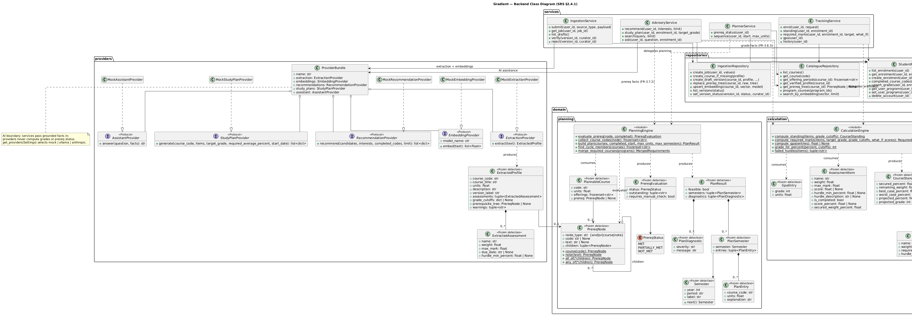
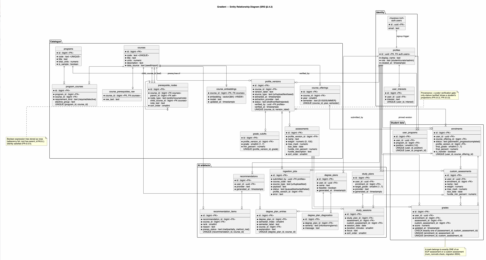

# Software Requirements Specification

## for Gradient — Grade Tracking & Degree Planning for University of Queensland Students

**Prepared by:** Gradient Team
**Date:** 6 July 2026
**Version:** 1.0 (Consolidated Master)

---

## Table of Contents

1. **Introduction**
   1.1. Purpose
   1.2. Document Conventions
   1.3. Intended Audience and Reading Suggestions
   1.4. Project Scope
   1.5. References
2. **Overall Description**
   2.1. Product Perspective
   2.2. Product Features
   2.3. User Classes and Characteristics
   2.4. System Design
   &nbsp;&nbsp;&nbsp;&nbsp;2.4.1. Class Diagram
   &nbsp;&nbsp;&nbsp;&nbsp;2.4.2. Entity Relationship Diagram (ERD)
3. **System Features**
   3.1. User Authentication & Account Management
   3.2. Grade & Assessment Tracking
   3.3. Target-Grade Calculator (Required Marks)
   3.4. Course History & Academic Record
   3.5. Course Profile Import & Data Extraction
   3.6. Degree Planner & Prerequisite Tracking
   3.7. AI Course Recommendations
   3.8. AI Study Plans
   3.9. Course Search & Assistant
4. **External Interface Requirements**
   4.1. User Interface
   4.2. Hardware Interface
   4.3. Software Interface
   4.4. Communication / Network Interface
5. **Non-functional Requirements**
   5.1. Performance Requirements
   5.2. Scalability Requirements
   5.3. Security & Privacy Requirements

**Appendix A — Consolidation & Reconciliation Notes**

---

## 1. Introduction

### 1.1. Purpose

This document specifies the requirements for **Gradient**, a web application that lets university students track their grades in one place, understand exactly how many marks they still need on remaining assessment to reach a target result, and plan the sequence of courses in their degree (or dual degree) around prerequisite constraints. It also helps students discover relevant courses and offers optional AI-generated study plans and course recommendations.

Gradient targets students at the University of Queensland (UQ) for its first release, and is designed so the same model generalises to other institutions with a defined grading scale and published course profiles. The application replaces several time-consuming manual chores — gathering marks scattered across different systems, hunting through course profiles for pass and distinction requirements, doing the arithmetic to work out what is still needed, and reading prerequisite chains to plan future study — with a single automated dashboard.

This SRS defines the product's scope, its functional and non-functional requirements, external interfaces, and the intended system architecture, at a level sufficient for the team to design, build, and test the first release.

### 1.2. Document Conventions

- The document follows the IEEE 830 Software Requirements Specification structure, and its sections are numbered to match the Table of Contents.
- Functional requirements are labelled **FR-x.y.z** and non-functional requirements **NFR-x.y.z** so that later design and test artefacts can trace back to them. Because this master consolidates and renumbers two source drafts, these labels may differ from those in either original.
- **"Shall"** denotes a mandatory requirement for the first release; **"should"** denotes a desirable requirement that may be deferred; **"may"** denotes an optional capability.
- The document uses Calibri as its main font, with bold headings, and standard A4 pages (in the Word version) with a generated table of contents and page numbers.
- Grades are expressed on the UQ 1–7 scale. A numeric **grade** (1–7) is derived from a **final percentage** (0–100) using per-course cut-offs. The default cut-offs used throughout are shown below. These defaults are **not authoritative** — a course's Electronic Course Profile (ECP) may override them, and the current official cut-offs must be confirmed against UQ's Assessment Procedure before release.

| Grade | Default final % band | Indicative descriptor |
| :---: | :------------------: | :-------------------- |
|   7   |       85–100       | High Distinction      |
|   6   |        75–84        | Distinction           |
|   5   |        65–74        | Credit                |
|   4   |        50–64        | Pass                  |
|   3   |        45–49        | Fail (marginal)       |
|   2   |        20–44        | Fail                  |
|   1   |        0–19        | Fail (low)            |

- **ECP** = Electronic Course Profile (UQ's published, per-course document listing assessment items, weights, hurdles, and grade descriptors).
- **Hurdle** = a pass condition that is independent of the weighted total (e.g. "must score at least 40% on the final exam").
- **GPA / WGPA** = (Weighted) Grade Point Average, computed on the 1–7 scale weighted by each course's unit value.

### 1.3. Intended Audience and Reading Suggestions

This document is intended for:

- **Developers / engineers** building the frontend, backend, calculation and planning engines, and the data-extraction pipeline.
- **UI / UX designers** designing the single-page dashboard, planner, and recommendation and study-plan views.
- **Testers** deriving test cases from the functional and non-functional requirements.
- **Project leads / product owner / project managers** tracking scope and priorities against the pitch timeline.
- **Data curators / administrators** responsible for maintaining and validating the course-profile dataset.
- **End users (UQ students) and academic advisors** understanding what the product does and, in a future release, how advisor access would work.

Suggested reading order: developers and designers should read all sections; testers should focus on §3 and §5; product, curator, and advisor roles can read §1, §2, and §3. Readers who want the rationale behind the technology and architecture choices should read the companion memo `Gradient_Design_Evaluation.md`.

### 1.4. Project Scope

Gradient is a student-facing web application. Its scope for the first release is:

**In scope**

- Recording assessment items and marks per course, and deriving the current standing and projected grade on the 1–7 scale.
- Calculating the marks required on remaining assessment to reach a pass (grade 4) or any user-selected target grade, including handling of hurdles and "already secured / not reachable" cases.
- Importing assessment structure (items, weights, hurdles, grade cut-offs) and prerequisite rules from a course's ECP so students do not re-enter them by hand.
- Maintaining a history of completed courses with their grades and GPA/WGPA contribution, alongside courses in progress.
- Computing GPA / WGPA across a student's completed and in-progress courses.
- Suggesting a valid study sequence for a student's program(s) and reporting prerequisite status, supporting students enrolled in two degrees simultaneously.
- Semantic search over course descriptions, and optional AI-generated course recommendations and study plans as advisory aids.

**Out of scope for the first release** (see Appendix A and `Gradient_Design_Evaluation.md`, §6, for reasoning)

- Automatically pulling a student's private marks from institutional learning-management systems (e.g. Learn.UQ/Blackboard, Gradescope, Turnitin) by scraping behind their login. Direct grade synchronisation via an approved UQ API is recorded as a **planned future enhancement** (see §4.3, NFR-5.1.6, NFR-5.3.3), deferred from the first release on reliability and security grounds and pending UQ IT approval and an official data source; the first release relies on manual score entry plus ECP-imported structure.
- Official enrolment, course registration, or any write-back to university systems. Gradient is an advisory tool only.
- Institutions other than UQ, and advisor-facing features, although the data model is designed not to preclude them.

Gradient's outputs — including its projections and any AI-generated recommendations or study plans — are **estimates to support a student's own decisions**. The relevant ECP and official university records remain authoritative, and the application states this to the user.

### 1.5. References

- [1] IEEE, *IEEE Recommended Practice for Software Requirements Specifications*, IEEE Std 830-1998.
- [2] `gradient_plan` — internal problem/solution and feature brief for Gradient (a source document for this SRS).
- [3] The University of Queensland, *Assessment Procedure* and grading policy (UQ Policy and Procedures Library) — authoritative source for the 1–7 grade scale, default cut-offs, hurdle rules, and GPA calculation. To be confirmed against the current published version before release.
- [4] The University of Queensland, *Electronic Course Profiles* — per-course published assessment structure, weights, and grade descriptors (data source for §3.5).
- [5] The University of Queensland, *Program and Course Catalogue* (programs-courses.uq.edu.au) — course descriptions, offering patterns, and prerequisite rules.
- [6] FastAPI, Supabase (PostgreSQL + `pgvector`), and React project documentation — implementation platforms referenced in §2.4 and §4.3.
- [7] Language-model and embedding-model documentation for the chosen deployment — a self-hosted runtime (e.g. Ollama / vLLM) or a hosted API (e.g. the Anthropic Claude API); see §2.4 and Appendix A.
- [8] The University of Queensland, *Learn.UQ (Blackboard)* — referenced only for the deferred future grade-synchronisation integration (§1.4, §4.3).

---

## 2. Overall Description

### 2.1. Product Perspective

Today a student who wants to know "what do I need on the final to pass?" must do several tedious things by hand. Marks for a single course can live in different systems (an LMS gradebook, an autograder, a similarity checker), so the student first has to collect and add them up. Then they have to open the course profile, read past the descriptions to find the percentage bands for a pass and a distinction, and note any hurdle they must clear. Finally they have to do the arithmetic — repeatedly, for each course, every time a new mark comes back. Planning a degree is worse still: the student has to read the prerequisite chain for every course and work out a legal order to take them, and a student on two degrees has to reconcile two sets of rules at once.

Gradient collapses all of this into one page. A student records their marks; the system already knows the course's assessment weights, cut-offs, and hurdles (imported from the ECP), so it can immediately show the current standing, the projected grade, and the exact marks still required to hit any target. For degree planning it reads the prerequisite structure, reports whether each course's prerequisites are met, and proposes a valid, ordered study plan, including for dual-degree students. Optional AI features suggest relevant courses and generate personalised study plans.

Gradient is a **new, standalone product**. It is not a component of any existing system and does not depend on privileged access to university systems; it consumes public course-profile information and marks that the student supplies or confirms. Direct integration with UQ's learning-management system to synchronise grades is anticipated as a future enhancement but is not required for the first release.

### 2.2. Product Features

The features that will be available are:

- The system shall provide authentication (registration, login, logout) so each student has a private account, and all data a student enters is owned by, and visible only to, that student.
- Students shall be able to record assessment items and their marks for each course, using the UQ 1–7 grading system, and see their aggregated standing per course and across their program.
- Students shall be able to see how many marks they need on their remaining assessment to obtain a pass (grade 4), and to set their own target (for example, the marks needed to obtain a grade 6), with the system accounting for assessment weights and hurdle conditions.
- The system shall import a course's grade requirements — together with its assessment items, weights, hurdles, and prerequisite rules — from the course's ECP, so students do not have to locate and transcribe them.
- The system shall maintain a history of completed courses and grades, with each course's GPA/WGPA contribution.
- The system shall recommend a plan of study from the ECPs and prerequisites of the courses relevant to a student's program(s), including for students studying two degrees simultaneously, and shall flag whether each course's prerequisites are met.
- The system may provide AI-generated course recommendations and study plans, presented as advisory aids.
- Students should be able to search courses by meaning (for example, "machine learning" or "sustainability") to discover relevant electives.

### 2.3. User Classes and Characteristics

- **Student (primary user).** A university student tracking their own grades and planning their own degree. Assumed to know their marks and their program of enrolment but not to want to do repetitive arithmetic or read course profiles line by line. A student may be enrolled in a **single degree** or in **two degrees simultaneously**; dual-degree enrolment is a characteristic of the student, not a separate user class, and the planner must handle both. Students are the owners of their own grade data.
- **Administrator / Data Curator.** A maintainer who manages the course-profile dataset: triggering ECP imports, reviewing and correcting extracted assessment structures, cut-offs, and prerequisites before students rely on them, and marking a course's data as verified for a given profile version. This role exists because automatically extracted profile data must be validated for correctness before it drives a student's grade projection (see §3.5).
- **Academic Advisor (future scope).** May view a student's course history, prerequisite status, and recommendations to support advising conversations, with the student's explicit permission. Not part of the first release.
- **Guest (optional).** An unauthenticated visitor who may use a stateless "what-if" target-grade calculator without saving any data, as a way to try the product before creating an account.

### 2.4. System Design

The system uses a layered, service-oriented design. The guiding principle is a strict separation between **deterministic logic that must be correct** (grade arithmetic, GPA, prerequisite satisfaction, plan validity) and **language-model assistance**. Deterministic logic is computed by the application's own code and is never delegated to a language model. Language-model assistance is used for (a) extracting structure from public course-profile text, (b) generating advisory course recommendations and study plans, (c) an optional natural-language assistant, and (d) semantic search. Where an AI-generated recommendation or plan cites a fact such as a required mark or whether a prerequisite is met, that fact is supplied by the deterministic engine, not produced by the model. Any language-model processing that involves a student's own data is performed on self-hosted models within the project's own infrastructure, so student marks and personal data never leave it. The reasoning for this split is given in `Gradient_Design_Evaluation.md`, §2–§5.

**Layers**

- **Presentation — React single-page application.** A single dashboard through which a student records marks, reads their standing and required-marks projections, views their history and prerequisite status, and views and edits their study plan. Communicates with the backend over HTTPS/JSON, and with the authentication and simple-read services directly via the Supabase client under row-level security.
- **Application — Python (FastAPI) backend.** Hosts and orchestrates the system's logic:
  - the **Calculation Engine** (deterministic): current standing, projected grade, required-marks calculation, hurdle checks, and GPA/WGPA. This is plain arithmetic and contains no language model;
  - the **Planning Engine** (deterministic): builds the prerequisite dependency graph, evaluates prerequisite satisfaction, and produces a valid, ordered study plan subject to program rules, unit load, and offering pattern;
  - the **Ingestion Pipeline** (language-model assisted, batch): extracts assessment items, weights, hurdles, grade cut-offs, and prerequisites from public ECP text into structured records, for curator review;
  - the **AI Assistance subsystem** (self-hosted): generates advisory course recommendations and study plans from the student's own record, and backs the optional natural-language assistant;
  - the **Search Service**: turns course descriptions into embeddings and answers semantic queries.
- **Data — Supabase.** Managed PostgreSQL for relational data, the `pgvector` extension for course-embedding storage and similarity search (so relational data and the vector store are one system rather than two), Supabase Storage for uploaded ECP source files, and Supabase Auth for identity. **Row-Level Security (RLS)** enforces that a student can read and write only their own rows.

**Core data entities** (relational model; a full ERD to be produced during design)

- **User** — one per student/administrator; owns all of that user's records.
- **Program** — a degree; a student may be linked to one or two Programs.
- **Course** — a unit of study, with a code, title, unit value, description, offering pattern, and default grade cut-offs. Shared across users.
- **CoursePrerequisite** — directed edges expressing a course's prerequisite expression (e.g. "COMP1000 and (MATH1051 or MATH1071)") as structured data, forming a dependency graph.
- **Assessment** — an assessment item belonging to a Course profile version, with a name, weight, maximum mark, due date, and any hurdle rule. Populated from the ECP.
- **Enrolment** — a student's link to a Course (planned, in-progress, or completed).
- **Grade** — a student's recorded mark on an Assessment (raw score out of maximum), owned by the student.
- **CourseEmbedding** — the vector representation of a Course's description, stored in `pgvector` for §3.9.
- **Recommendation / StudyPlan** — AI-generated advisory artefacts tied to a student, regenerable on demand (§3.7–§3.8).
- **ProfileVersion / verification metadata** — records which ECP version a Course's assessment data came from, when it was extracted, and whether a curator has verified it (supports the provenance requirement in §3.5).

#### 2.4.1. Class Diagram

2.4.2. Entity Relationship Diagram (ERD)

3. System Features

### 3.1. User Authentication & Account Management

The system provides identity so that every student's data is private and owned by that student.

- **FR-3.1.1** The system shall allow a visitor to register an account using an email address and password, and should support institutional single sign-on / OAuth as an alternative.
- **FR-3.1.2** The system shall allow a registered user to log in and log out.
- **FR-3.1.3** All grade, enrolment, and plan data a user creates shall be owned by that user and shall be inaccessible to any other user, enforced at the database layer via row-level security.
- **FR-3.1.4** The system shall allow a user to delete their account and associated personal data.
- **FR-3.1.5** The system may allow an unauthenticated guest to use the target-grade calculator (§3.3) without persisting any data.

### 3.2. Grade & Assessment Tracking

The system records marks and shows the student where they stand.

- **FR-3.2.1** The system shall allow a student to add a course to their profile (by selecting an existing Course or, where absent, creating a placeholder), and to mark each course as planned, in-progress, or completed.
- **FR-3.2.2** For an in-progress or completed course, the system shall present the course's assessment items and their weights, pre-filled from the ECP where available (§3.5), and shall allow the student to add, edit, or remove items where no verified profile exists.
- **FR-3.2.3** The system shall allow a student to enter their raw mark (score out of maximum) for each assessment item, displaying each item's weight toward the final course mark.
- **FR-3.2.4** The system shall compute and display, per course, the marks secured so far, the best-case and worst-case final percentages, and the projected grade on the 1–7 scale using the course's cut-offs.
- **FR-3.2.5** The system shall compute and display the student's GPA / WGPA across their completed and in-progress courses, weighted by each course's unit value, using the calculation rules of reference [3].
- **FR-3.2.6** The system shall present a student's marks and standing on a single page/dashboard, consistent with the product's single-page goal.

### 3.3. Target-Grade Calculator (Required Marks)

This is the core feature: telling a student what they still need. All computation here is deterministic arithmetic.

- **FR-3.3.1** For a given course, the system shall let the student choose a target — a pass (grade 4) by default, or any grade (e.g. 6) — and shall compute the average mark required across the remaining (not-yet-completed) assessment items to reach that target's percentage threshold.
- **FR-3.3.2** The required-marks calculation shall use: the marks already secured (each completed item's percentage multiplied by its weight), the total weight of the remaining items, and the target percentage. The required average across remaining items shall be `(target% − secured%) ÷ (remaining weight) × 100`.
- **FR-3.3.3** The system shall correctly report the boundary cases: the target is **already secured** (required average ≤ 0), the target is **not reachable** (required average > 100), or **no assessment remains** (grade is locked).
- **FR-3.3.4** The system shall evaluate hurdle conditions independently of the weighted total, and shall flag any hurdle that blocks the target even when the weighted total is reachable (for example, a required minimum on the final exam).
- **FR-3.3.5** The system should present the result both as a single required average and, where useful, as a per-item breakdown, and should let the student see how a hypothetical mark on one remaining item changes what is required on the others ("what-if").
- **FR-3.3.6** The system shall not use a language model to perform any part of this calculation, and shall be covered by automated tests over representative and boundary inputs (see NFR-5.3.4 and the companion memo §2).

### 3.4. Course History & Academic Record

The system maintains the student's completed-course record for their own reference and as an input to planning and recommendation.

- **FR-3.4.1** The system shall maintain a record of all courses a student has completed, including the final grade and each course's GPA/WGPA contribution, and shall display this alongside courses currently in progress.
- **FR-3.4.2** The course history shall be available as an input to prerequisite checking (§3.6), course recommendation (§3.7), and planning, so that these features reflect what the student has already completed.
- **FR-3.4.3** The system shall allow a student to add historical or transferred courses and grades that predate their use of the application, so the record is complete.

### 3.5. Course Profile Import & Data Extraction

The system imports assessment structure and requirements from ECPs so students do not transcribe them.

- **FR-3.5.1** The system shall obtain a course's ECP content from its published source (public course-profile page or an uploaded profile file) and extract the assessment items, their weights, maximum marks and due dates, any hurdle rules, and the course's grade cut-offs.
- **FR-3.5.2** The system shall store extracted assessment data against the specific ECP/profile version it came from, together with a timestamp and the extraction's provenance.
- **FR-3.5.3** Extracted profile data shall be reviewable and correctable by an administrator / curator, and shall be marked **verified** before it is used to drive a student's grade projection. Unverified data may be shown to students only with a clear "unverified — check your course profile" indication.
- **FR-3.5.4** The system shall parse a course's prerequisite text into a structured expression suitable for the planner (§3.6).
- **FR-3.5.5** The extraction pipeline shall operate on public course-profile text only. It shall not be given any student's marks or personal data.
- **FR-3.5.6** Because extraction runs once per course-profile version and is reused for every student taking that course, the system shall cache extracted results rather than re-extracting per student.

### 3.6. Degree Planner & Prerequisite Tracking

The system proposes a valid order in which to take courses and reports prerequisite status.

- **FR-3.6.1** The system shall build a prerequisite dependency graph for the courses relevant to a student's program(s) from the structured prerequisite data (§3.5).
- **FR-3.6.2** The system shall produce a suggested study sequence that respects all prerequisites, a per-semester unit-load limit, and each course's offering pattern, and shall present it grouped by study period.
- **FR-3.6.3** The planner shall support a student enrolled in **two degrees simultaneously**, reconciling both programs' requirements and correctly treating a course that counts toward both.
- **FR-3.6.4** For each upcoming, planned, or recommended course, the system shall check the student's course history against the course's prerequisite rules and indicate whether prerequisites are **met, partially met, or not met**, identifying the outstanding course or requirement where they are not met.
- **FR-3.6.5** The system shall detect and report an infeasible plan (for example, an unsatisfiable prerequisite cycle or a required course that is never offered in the available windows) rather than returning an invalid sequence.
- **FR-3.6.6** The system should let the student express preferences (for example, "prioritise courses I have the prerequisites for now" or a topic interest) and reflect them in the ordering, and should explain why a course was placed where it was.
- **FR-3.6.7** The correctness of a produced plan and of every prerequisite-status determination (prerequisite satisfaction, load limits) shall be guaranteed by the deterministic planner, not delegated to a language model (companion memo §4).

### 3.7. AI Course Recommendations

The system offers advisory suggestions for future courses. Recommendations are aids, not authoritative advice.

- **FR-3.7.1** The system may recommend future courses based on the student's program requirements, completed courses, grades achieved, and any stated interests or career goals.
- **FR-3.7.2** Each recommendation shall include a brief explanation of why the course is suggested and shall clearly indicate whether the course's prerequisites are currently met, with that prerequisite status supplied by the deterministic engine (§3.6), not produced by the model.
- **FR-3.7.3** Recommendations shall be presented as advisory only; the student's official program requirements and the relevant ECP remain authoritative.
- **FR-3.7.4** Any language-model processing of the student's own record to produce recommendations shall be performed on self-hosted infrastructure, so that no student marks or personal data are sent to a third-party service (see NFR-5.3.4).

### 3.8. AI Study Plans

The system can generate a personalised study schedule for upcoming assessment. Study plans are advisory.

- **FR-3.8.1** For a selected course or set of upcoming assessment, the system may generate a personalised study plan that accounts for assessment due dates, weighting, the student's target percentage, and marks already achieved, and that breaks study into manageable sessions leading up to each assessment item.
- **FR-3.8.2** The system shall allow the student to regenerate or adjust a study plan as circumstances change.
- **FR-3.8.3** Study plans shall be presented as advisory; any figures they cite (required marks, weights, due dates) shall be drawn from the deterministic engine and the imported ECP data, not invented by the model.
- **FR-3.8.4** Any language-model processing of student-specific inputs to produce study plans shall be performed on self-hosted infrastructure (see NFR-5.3.4).

### 3.9. Course Search & Assistant

The system helps students discover relevant courses.

- **FR-3.9.1** The system shall allow a student to search courses by meaning, returning courses whose descriptions are semantically closest to the query, using embedding-based similarity over `pgvector`.
- **FR-3.9.2** Search shall operate over public course-description text; no student personal data is required to serve a search.
- **FR-3.9.3** The system may provide a natural-language assistant that answers questions about a course or a student's own plan, grounded in the stored course data. Where such an assistant is provided, any student-specific context supplied to it shall be handled under the privacy rules in §5.3 and the companion memo §5.

---

## 4. External Interface Requirements

### 4.1. User Interface

Students are presented with an interactive, responsive web application, accessible from desktop and mobile browsers, centred on a single dashboard. The interface shall be clear and easy to use, with forms for entering marks, prominent display of each course's standing and the marks still required for the chosen target, a history view of completed courses, and a planner view showing the suggested course sequence and prerequisite status by study period, plus access to recommendations and study plans. The interface should use plain visual cues (progress toward target, "reachable / already secured / not reachable" states, hurdle warnings, prerequisite met / partially met / not met) so a student understands their position at a glance, should be uncluttered and use UQ-appropriate branding conventions, and should meet common web accessibility expectations.

### 4.2. Hardware Interface

Gradient is a web application and requires no specialised hardware. A student needs a device — desktop, laptop, tablet, or phone — with a current web browser and an internet connection. No client-side installation, and no minimum processor/RAM/disk beyond what the chosen browser itself requires, are imposed by the application.

### 4.3. Software Interface

- **Frontend:** a React single-page application, served as static assets, running in current versions of mainstream browsers (Chrome, Firefox, Safari, Edge).
- **Backend:** a Python service built with FastAPI, exposing a JSON/HTTPS API and hosting the deterministic calculation and planning engines, the ingestion pipeline, the AI-assistance subsystem, and the search service.
- **Database & platform services:** Supabase — PostgreSQL for relational data, the `pgvector` extension for course embeddings and similarity search, Supabase Auth for identity, and Supabase Storage for uploaded profile files. Row-level security is enabled for per-user isolation.
- **Language-model service:** an LLM used for the ingestion pipeline (extracting structure from public ECP text) and for the AI recommendation, study-plan, and optional assistant features. Processing that involves a student's own data is run on **self-hosted models** (e.g. Ollama / vLLM) within the project's infrastructure; a hosted API (such as the Anthropic Claude API) may be used only for tasks that involve public text. See the companion memo §5 and Appendix A.
- **Embedding model:** a text-embedding model producing the vectors stored in `pgvector`. This is decoupled from the LLM provider and may be self-hosted; see companion memo §3.
- **Course-profile and catalogue source:** UQ Electronic Course Profiles and the UQ Program and Course Catalogue (public), consumed by the ingestion pipeline.
- **Future — learning-management system integration:** a planned, deferred integration with UQ's Learn.UQ / Blackboard via an approved mechanism (e.g. LTI or the Blackboard REST API), subject to UQ IT approval, to synchronise a student's enrolled courses, assessment items, and grades. Not part of the first release (§1.4).

### 4.4. Communication / Network Interface

All communication occurs over the public internet using HTTPS. The React client communicates with the FastAPI backend via a JSON REST API over TLS, and with Supabase Auth and Supabase's data services via the Supabase client over TLS (using WebSocket transport where realtime updates are used). All external service calls (database, storage, language-model, and embedding services) are made server-to-service over TLS. No student personal data is placed in URLs or query strings, and no student marks or personal data are transmitted to any third-party language-model or embedding service. When the future LMS integration is enabled, it shall communicate over HTTPS using UQ's approved authorisation flow and shall never store the student's UQ password; previously synced data shall remain viewable if the LMS is temporarily unavailable.

---

## 5. Non-functional Requirements

### 5.1. Performance Requirements

- **NFR-5.1.1** The dashboard shall become interactive within roughly 3 seconds on a typical broadband connection on first load, and subsequent in-app navigation shall respond within about 1 second.
- **NFR-5.1.2** The target-grade and GPA/WGPA calculations shall be effectively instantaneous (well under 200 ms), since they are arithmetic performed on a small number of items; they shall never sit on a slow external dependency.
- **NFR-5.1.3** A semantic course search shall return results within about 1 second for the expected catalogue size, using an approximate-nearest-neighbour index (e.g. HNSW) in `pgvector`.
- **NFR-5.1.4** ECP extraction is a batch operation off the student's critical path; its latency does not affect interactive performance, and its results are cached (FR-3.5.6).
- **NFR-5.1.5** AI-generated course recommendations and study plans should return within about 15 seconds, with a loading indicator shown while processing, and shall never block the deterministic dashboard from loading.
- **NFR-5.1.6** When the future LMS grade-synchronisation integration is enabled, a sync for a typical student's course load should complete within about 10 seconds, and previously synced data shall remain viewable if the LMS is temporarily unavailable.

### 5.2. Scalability Requirements

- **NFR-5.2.1** The backend shall be stateless so that it can be scaled horizontally behind a load balancer; session state lives in the client's auth token and in the database.
- **NFR-5.2.2** Database access shall use connection pooling suitable for a scaled/serverless deployment (e.g. Supabase's pooler) to stay within connection limits.
- **NFR-5.2.3** Extracted course-profile data shall be shared across all students taking a course and computed once per profile version, so cost and load grow with the size of the course catalogue, not with the number of students.
- **NFR-5.2.4** The application shall be extensible to additional features and to other institutions and student-information systems without a full rebuild of the core grade-tracking and planning features, through a clean layering of presentation, application logic, and data, and documented interfaces. (Deployment note: a free-tier Supabase project can pause after a period of inactivity; it must be woken ahead of any live demonstration.)

### 5.3. Security & Privacy Requirements

- **NFR-5.3.1** Every access to a student's data shall require authentication, and authorisation shall be enforced at the database layer through row-level security so that a student can only ever read or write their own rows.
- **NFR-5.3.2** All traffic shall be encrypted in transit (TLS/HTTPS), and student grade and personal data shall be encrypted at rest.
- **NFR-5.3.3** The system shall **not** collect or store a student's credentials for any external system (such as an institutional LMS), and the first release shall not scrape private marks on a student's behalf (§1.4, companion memo §6). When the future LMS integration is added, it shall use UQ's approved single sign-on / API authorisation flow and shall never store the student's UQ password.
- **NFR-5.3.4** No student marks or personal data shall be sent to any third-party language-model or embedding service; those services receive only public course-profile text. Student-specific reasoning — including AI recommendations and study plans — is performed by the deterministic engine and by self-hosted models on the project's own infrastructure.
- **NFR-5.3.5** Application secrets and service keys shall be held in environment configuration or a secret manager, never in client code or source control, and all user input shall be validated server-side.
- **NFR-5.3.6** Because Gradient handles students' personal academic information, its handling of that data should be reviewed against applicable privacy obligations (for Australian users, the Australian Privacy Principles), including data minimisation, retention, and the deletion capability in FR-3.1.4.
- **NFR-5.3.7** Because a student may make real decisions based on Gradient's figures, the application shall present its projections and any AI-generated recommendations or study plans as estimates or advice, and shall state that the relevant ECP and official university records are authoritative, including displaying the verification status and provenance of imported course data (§3.5). Any advisor access in a future release shall require the student's explicit consent.

---

## Appendix A — Consolidation & Reconciliation Notes

This master SRS consolidates two source drafts: `Gradient_SRS.md` (v1.0 draft, 3 July 2026) and `UQ_Gradient_SRS.docx` (5 July 2026). The structure and requirement labelling follow IEEE 830; because features from both drafts were merged, FR/NFR numbers were reassigned for internal consistency and may differ from either original. Two substantive differences between the drafts required a deliberate decision, recorded here so the team can review them.

**1. LMS (Learn.UQ / Blackboard) grade synchronisation.**
The `.docx` draft treated direct Blackboard API sync as the primary source of grade data; the `.md` draft placed it out of scope on reliability and security grounds. This master keeps manual mark entry plus ECP-imported structure as the first-release mechanism, and records LMS grade sync as a planned future enhancement (§1.4, §4.3, NFR-5.1.6, NFR-5.3.3), pending UQ IT approval and an approved/official data source. If the team decides LMS sync must ship in the first release, §1.4, §3, and §4 would need to be revised to make it in-scope.

**2. Use of AI / language models.**
The `.docx` draft introduced AI course recommendations and AI study plans; the `.md` draft confined language models to public-text ingestion and search and prohibited their use in grade calculations. This master keeps both AI features but constrains them: all correctness-critical logic (grade arithmetic, GPA, prerequisite satisfaction, plan validity) stays deterministic; any prerequisite or grade fact cited in an AI output is supplied by the deterministic engine; and any AI processing of a student's own data runs on self-hosted models so no student data leaves the project's infrastructure. This preserves the `.md` draft's privacy stance while delivering the `.docx` draft's features, and it fits the team's existing self-hosting capability.

**Open items for the team to confirm before release:**

- Confirm the current UQ grade cut-offs and GPA/WGPA calculation rules against the published Assessment Procedure (the bands in §1.2 are defaults only).
- Decide the timing and UQ-approval path for the LMS grade-synchronisation integration.
- Decide the AI hosting model (self-hosted vs hosted API) for each feature, consistent with NFR-5.3.4.
- Finalise the embedding-model selection (the earlier DeepSeek embedding assumption remains unverified per the design-evaluation memo).
- Decide whether academic-advisor access is in a near-term roadmap and, if so, its consent model.
